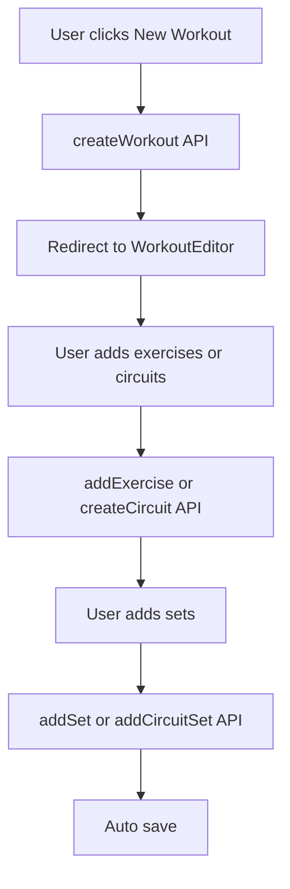
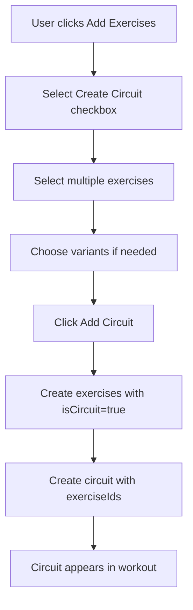
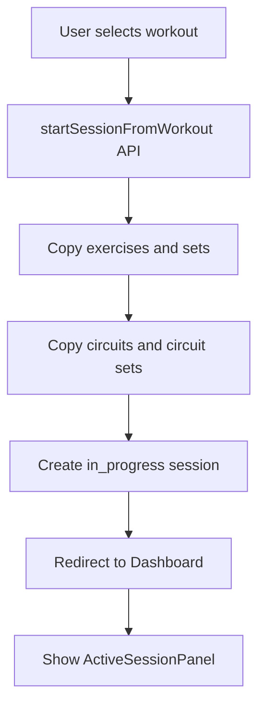
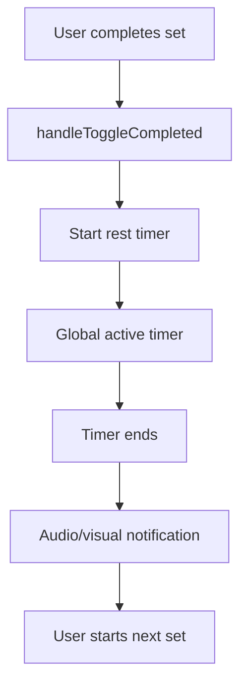
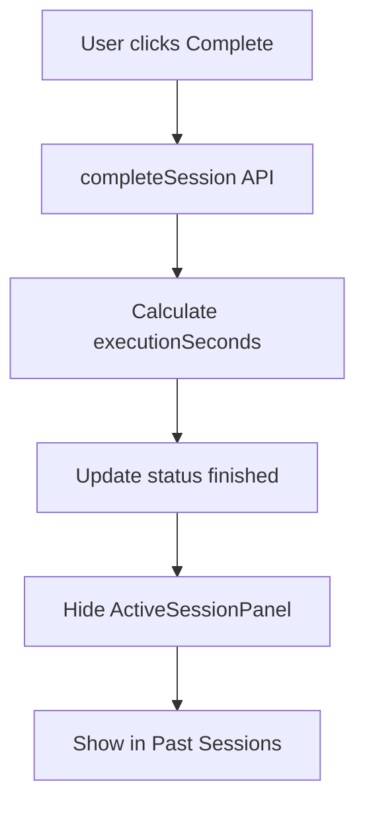

# Gym Diary - Complete Documentation

## 📋 Table of Contents
1. [System Overview](#system-overview)
2. [Frontend Architecture](#frontend-architecture)
3. [Firebase Backend](#firebase-backend)
4. [Workflows](#workflows)
5. [Components and Features](#components-and-features)
6. [APIs and Hooks](#apis-and-hooks)
7. [Types and Interfaces](#types-and-interfaces)
8. [Technical Details](#technical-details)

---

## 🎯 System Overview

Gym Diary is a comprehensive workout tracking application built with React, TypeScript, and Firebase. The system allows users to create, manage, and track their workouts with support for individual exercises and circuit training.

### Key Features
- **Workout Management**: Create, edit, and organize workouts
- **Exercise Library**: Extensive catalog of exercises with variants
- **Circuit Training**: Create multi-exercise circuits with shared sets
- **Session Tracking**: Real-time workout sessions with progress tracking
- **Rest Timer System**: Global timer with individual set timers
- **User Settings**: Customizable preferences and defaults
- **Progress History**: Complete session history and workout analytics

---

## 🏗️ Frontend Architecture

### Technology Stack
- **React 18**: Component-based UI framework
- **TypeScript**: Type-safe development
- **Firebase**: Authentication, database, and hosting
- **React Router**: Client-side routing
- **Lodash**: Utility functions for debouncing

### Project Structure
```
src/
├── api/           # Firebase API functions
├── components/    # Reusable UI components
├── contexts/      # React contexts for state management
├── hooks/         # Custom React hooks
├── pages/         # Main application pages
├── types/         # TypeScript type definitions
└── firebase.ts    # Firebase configuration
```

---

## 🔥 Firebase Backend

### Database Structure (Firestore)

#### Collections

**workouts/{workoutId}**
```typescript
{
  id: string;
  ownerId: string;
  date: Timestamp;
  title: string;
  notes?: string;
  createdAt: Timestamp;
  updatedAt: Timestamp;
}
```

**workouts/{workoutId}/exercises/{exerciseId}**
```typescript
{
  id: string;
  name: string;
  muscleGroup?: string;
  category: ExerciseCategory;
  variant?: ExerciseVariant;
  order: number;
  imageUrl?: string;
  defaultRestSec?: number;
  isCircuit?: boolean;        // NEW: Indicates if part of a circuit
  circuitId?: string;         // NEW: ID of the circuit this exercise belongs to
}
```

**workouts/{workoutId}/exercises/{exerciseId}/sets/{setId}**
```typescript
{
  id: string;
  order: number;
  reps: number;
  weight?: number;
  restSec?: number;
  note?: string;
  completed?: boolean;
  createdAt?: Timestamp;
  updatedAt?: Timestamp;
}
```

**workouts/{workoutId}/circuits/{circuitId}** (NEW)
```typescript
{
  id: string;
  workoutId: string;
  exerciseIds: string[];      // Array of exercise IDs in this circuit
  order: number;              // Order of the circuit within the workout
  createdAt: Timestamp;
  updatedAt: Timestamp;
}
```

**workouts/{workoutId}/circuits/{circuitId}/sets/{setId}** (NEW)
```typescript
{
  id: string;
  circuitId: string;
  order: number;
  restSec?: number;           // Shared rest time for all exercises in this circuit set
  completed?: boolean;        // Shared completion status for all exercises in this circuit set
  exercises: {
    exerciseId: string;
    reps: number;
    weight?: number;
    note?: string;
  }[];
  createdAt?: Timestamp;
  updatedAt?: Timestamp;
}
```

**sessions/{sessionId}**
```typescript
{
  id: string;
  ownerId: string;
  workoutTitle: string;
  workoutId: string;          // Reference to the original workout
  startedAt: Timestamp;
  endedAt?: Timestamp;
  executionSeconds?: number;
  status: SessionStatus;
}
```

**userSettings/{userId}**
```typescript
{
  id: string;
  ownerId: string;
  defaultRestSec: number;     // Default rest time in seconds
  units: 'kg' | 'lbs';
  theme: 'light' | 'dark' | 'auto';
  createdAt: Timestamp;
  updatedAt: Timestamp;
}
```

### Security Rules

```javascript
rules_version = '2';
service cloud.firestore {
  match /databases/{database}/documents {
    // Helper functions
    function isAuthenticated() {
      return request.auth != null;
    }
    
    function isOwner(userId) {
      return request.auth.uid == userId;
    }
    
    // Rules for users
    match /users/{userId} {
      allow read, write: if isAuthenticated() && isOwner(userId);
    }
    
    // Rules for userSettings
    match /userSettings/{settingsId} {
      allow read, write: if isAuthenticated() && isOwner(settingsId);
    }
    
    // Rules for workouts
    match /workouts/{workoutId} {
      allow read, write: if isAuthenticated() && isOwner(resource.data.ownerId);
      
      // Rules for exercises
      match /exercises/{exerciseId} {
        allow read, write: if isAuthenticated() && isOwner(get(/databases/$(database)/documents/workouts/$(workoutId)).data.ownerId);
        
        // Rules for sets
        match /sets/{setId} {
          allow read, write: if isAuthenticated() && isOwner(get(/databases/$(database)/documents/workouts/$(workoutId)).data.ownerId);
        }
      }
      
      // Rules for circuits (NEW)
      match /circuits/{circuitId} {
        allow read, write: if isAuthenticated() && isOwner(get(/databases/$(database)/documents/workouts/$(workoutId)).data.ownerId);
        
        // Rules for circuit sets (NEW)
        match /sets/{setId} {
          allow read, write: if isAuthenticated() && isOwner(get(/databases/$(database)/documents/workouts/$(workoutId)).data.ownerId);
        }
      }
    }
    
    // Rules for sessions
    match /sessions/{sessionId} {
      allow read, write: if isAuthenticated() && isOwner(resource.data.ownerId);
      
      // Rules for session exercises
      match /exercises/{exerciseId} {
        allow read, write: if isAuthenticated() && isOwner(get(/databases/$(database)/documents/sessions/$(sessionId)).data.ownerId);
        
        // Rules for session sets
        match /sets/{setId} {
          allow read, write: if isAuthenticated() && isOwner(get(/databases/$(database)/documents/sessions/$(sessionId)).data.ownerId);
        }
      }
    }
  }
}
```

### Firestore Indexes

```json
{
  "indexes": [
    {
      "collectionGroup": "workouts",
      "queryScope": "COLLECTION",
      "fields": [
        { "fieldPath": "ownerId", "order": "ASCENDING" },
        { "fieldPath": "date", "order": "DESCENDING" }
      ]
    },
    {
      "collectionGroup": "exercises",
      "queryScope": "COLLECTION_GROUP",
      "fields": [
        { "fieldPath": "order", "order": "ASCENDING" }
      ]
    },
    {
      "collectionGroup": "sets",
      "queryScope": "COLLECTION_GROUP",
      "fields": [
        { "fieldPath": "order", "order": "ASCENDING" }
      ]
    },
    {
      "collectionGroup": "circuits",
      "queryScope": "COLLECTION_GROUP",
      "fields": [
        { "fieldPath": "order", "order": "ASCENDING" }
      ]
    },
    {
      "collectionGroup": "circuitSets",
      "queryScope": "COLLECTION_GROUP",
      "fields": [
        { "fieldPath": "order", "order": "ASCENDING" }
      ]
    },
    {
      "collectionGroup": "sessions",
      "queryScope": "COLLECTION",
      "fields": [
        { "fieldPath": "ownerId", "order": "ASCENDING" },
        { "fieldPath": "endedAt", "order": "DESCENDING" }
      ]
    },
    {
      "collectionGroup": "sessions",
      "queryScope": "COLLECTION",
      "fields": [
        { "fieldPath": "ownerId", "order": "ASCENDING" },
        { "fieldPath": "workoutId", "order": "ASCENDING" },
        { "fieldPath": "endedAt", "order": "DESCENDING" }
      ]
    }
  ]
}
```

---

## 🔄 Workflows

### 1. Workout Creation


### 2. Circuit Creation (NEW)


### 3. Start Session


### 4. Execute Session


### 5. Complete Session


---

## 🧩 Components and Features

### Main Components

#### 1. Dashboard (`src/pages/Dashboard.tsx`)
**Features:**
- Manage Workouts/Sessions tabs
- Display workout cards in grid
- Past sessions table
- Active session management

**State:**
```typescript
const [tab, setTab] = useState<'workouts' | 'sessions'>('workouts');
const [workouts, setWorkouts] = useState<Workout[]>([]);
const [pastSessions, setPastSessions] = useState<Session[]>([]);
const [activeSession, setActiveSession] = useState<Session | null>(null);
```

#### 2. WorkoutEditor (`src/pages/WorkoutEditor.tsx`)
**Features:**
- Edit workout title and notes
- Add/remove exercises and circuits
- Manage sets for each exercise and circuit
- Autosave

#### 3. AddExerciseForm (`src/components/AddExerciseForm.tsx`)
**Features:**
- Exercise catalog with filtering
- Single exercise selection
- Circuit creation with multi-selection
- Variant selection for exercises

#### 4. Circuit (`src/components/Circuit.tsx`) (NEW)
**Features:**
- Display circuit with all exercises
- Manage shared circuit sets
- Individual exercise parameters within sets
- Shared rest timer and completion status

#### 5. ActiveSessionPanel (`src/components/ActiveSessionPanel.tsx`)
**Features:**
- View active session
- Global session timer
- Complete/Cancel controls
- Request notification permissions

#### 6. SessionExerciseManager (`src/components/SessionExerciseManager.tsx`)
**Features:**
- Manage exercises during session
- Add sets on-demand
- Update exercise state

#### 7. SessionExercise (`src/components/SessionExercise.tsx`)
**Features:**
- Display single exercise
- Manage individual sets
- Rest timer for sets
- Complete set

#### 8. RestTimer (`src/components/RestTimer.tsx`)
**Features:**
- Individual rest timer
- Play/pause/reset controls
- Progress bar
- Global timer integration

#### 9. Exercise (`src/components/Exercise.tsx`)
**Features:**
- Display exercise in editor
- Manage sets with timer
- Edit/delete controls

### Global Timer System

#### Hook: `useSingleActiveTimer` (`src/hooks/useSingleActiveTimer.ts`)
**Features:**
- Manage single active timer
- Time calculation based on timestamp
- Start/stop/pause/resume controls

**State:**
```typescript
interface ActiveTimer {
  id: string;
  restSec: number;
  timeLeft: number;
  isRunning: boolean;
  exerciseName: string;
  setNumber: number;
  startTime: number; // Timestamp when the timer started
}
```

#### Context: `SingleTimerContext` (`src/contexts/SingleTimerContext.tsx`)
**Features:**
- Global timer sharing
- App-wide provider

---

## 🔌 APIs and Hooks

### API Workouts (`src/api/workouts.ts`)

#### Main Functions:
```typescript
// Create workout
createWorkout(ownerId: string): Promise<string>

// Get workouts
getWorkouts(ownerId: string): Promise<QuerySnapshot>

// Get single workout
getWorkout(workoutId: string): Promise<Workout>

// Update workout
updateWorkout(id: string, data: Partial<Workout>): Promise<void>

// Delete workout
deleteWorkout(id: string): Promise<void>

// Exercises management
getExercises(workoutId: string): Promise<QuerySnapshot>
addExercise(workoutId: string, data: Omit<Exercise, 'id'>): Promise<DocumentReference>
deleteExercise(workoutId: string, exerciseId: string): Promise<void>

// Sets management
getSets(workoutId: string, exerciseId: string): Promise<QuerySnapshot>
addSet(workoutId: string, exerciseId: string, data: Partial<Set>, defaultRestSec?: number): Promise<DocumentReference>
updateSet(workoutId: string, exerciseId: string, setId: string, data: Partial<Omit<Set, 'id'>>): Promise<void>
deleteSet(workoutId: string, exerciseId: string, setId: string): Promise<void>

// Circuit management (NEW)
createCircuit(workoutId: string, exerciseIds: string[], order: number): Promise<string>
getCircuits(workoutId: string): Promise<QuerySnapshot>
updateCircuit(workoutId: string, circuitId: string, data: Partial<Omit<Circuit, 'id' | 'workoutId'>>): Promise<void>
deleteCircuit(workoutId: string, circuitId: string): Promise<void>

// Circuit sets management (NEW)
addCircuitSet(workoutId: string, circuitId: string, data: Omit<CircuitSet, 'id' | 'circuitId'>): Promise<string>
getCircuitSets(workoutId: string, circuitId: string): Promise<QuerySnapshot>
updateCircuitSet(workoutId: string, circuitId: string, setId: string, data: Partial<Omit<CircuitSet, 'id' | 'circuitId'>>): Promise<void>
deleteCircuitSet(workoutId: string, circuitId: string, setId: string): Promise<void>
```

### API Sessions (`src/api/sessions.ts`)

#### Main Functions:
```typescript
// Active sessions management
getActiveSession(ownerId: string): Promise<Session | null>
startSessionFromWorkout(ownerId: string, workout: Workout): Promise<string>

// Session state management
completeSession(sessionId: string): Promise<void>
cancelSession(sessionId: string): Promise<void>
updateSessionExecutionTime(sessionId: string, seconds: number): Promise<void>

// Sessions history
getSessionsHistory(ownerId: string): Promise<Session[]>
deleteAllPastSessions(ownerId: string): Promise<void>

// Last workout execution
getLastExecutionDate(ownerId: string, workoutId: string): Promise<Date | null>

// Session exercises management
populateSessionExercises(sessionId: string): Promise<Exercise[]>
addExerciseToSession(sessionId: string, exercise: Omit<Exercise, 'id'>): Promise<string>
removeExerciseFromSession(sessionId: string, exerciseId: string): Promise<void>

// Session sets management
getSessionSets(sessionId: string, exerciseId: string): Promise<QuerySnapshot>
addSessionSet(sessionId: string, exerciseId: string, data: Partial<Set>, defaultRestSec?: number): Promise<DocumentReference>
updateSessionSet(sessionId: string, exerciseId: string, setId: string, data: Partial<Omit<Set, 'id'>>): Promise<void>
deleteSessionSet(sessionId: string, exerciseId: string, setId: string): Promise<void>
toggleSetCompleted(sessionId: string, exerciseId: string, setId: string): Promise<void>
```

### API UserSettings (`src/api/userSettings.ts`)

#### Functions:
```typescript
// Get settings (creates defaults if missing)
getUserSettings(userId: string): Promise<UserSettings>

// Update settings
updateUserSettings(userId: string, updates: Partial<UserSettings>): Promise<void>
```

---

## 📝 Types and Interfaces

### Main Types (`src/types/index.ts`)

```typescript
// Exercise categories
type ExerciseCategory = 'machine' | 'bodyweight' | 'dumbbells' | 'barbell' | 'cable' | 'multipower' | 'other';

// Exercise variants
type ExerciseVariant = 'flat' | 'incline' | 'decline' | 'wide-grip' | 'close-grip' | 'reverse-grip' | 'neutral-grip' | 'front' | 'back-highbar' | 'back-lowbar' | 'pause' | 'box' | 'goblet' | 'safety-bar' | 'trap-bar' | 'conventional' | 'sumo' | 'rdl' | 'stiff-leg' | 'seated' | 'standing' | 'push-press' | 'arnold' | 'preacher' | 'ez-bar' | 'rope' | 'cable' | 'walking' | 'reverse' | 'bulgarian';

// Session status
type SessionStatus = 'created' | 'in_progress' | 'finished' | 'cancelled';

// Units
type Units = 'kg' | 'lbs';

// Theme
type Theme = 'light' | 'dark' | 'auto';
```

### Main Interfaces

```typescript
export interface Workout {
  id: string;
  ownerId: string;
  date: Timestamp;
  title: string;
  notes?: string;
  createdAt: Timestamp;
  updatedAt: Timestamp;
}

export interface Exercise {
  id: string;
  name: string;
  muscleGroup?: string;
  category: ExerciseCategory;
  variant?: ExerciseVariant;
  order: number;
  imageUrl?: string;
  defaultRestSec?: number; // Default rest time
  isCircuit?: boolean;     // NEW: Indicates if part of a circuit
  circuitId?: string;      // NEW: ID of the circuit this exercise belongs to
}

export interface Circuit {  // NEW
  id: string;
  workoutId: string;
  exerciseIds: string[];   // Array of exercise IDs in this circuit
  order: number;           // Order of the circuit within the workout
  createdAt: Timestamp;
  updatedAt: Timestamp;
}

export interface CircuitSet {  // NEW
  id: string;
  circuitId: string;
  order: number;
  restSec?: number;        // Shared rest time for all exercises in this circuit set
  completed?: boolean;     // Shared completion status for all exercises in this circuit set
  exercises: {
    exerciseId: string;
    reps: number;
    weight?: number;
    note?: string;
  }[];
  createdAt?: Timestamp;
  updatedAt?: Timestamp;
}

export interface Set {
  id: string;
  order: number;
  reps: number;
  weight?: number;
  restSec?: number;        // Specific rest time
  note?: string;
  completed?: boolean;
  createdAt?: Timestamp;
  updatedAt?: Timestamp;
}

export interface Session {
  id: string;
  ownerId: string;
  workoutTitle: string;
  workoutId: string;       // Reference to the original workout
  startedAt: Timestamp;
  endedAt?: Timestamp;
  executionSeconds?: number;
  status: SessionStatus;
}

export interface UserSettings {
  id: string;
  ownerId: string;
  defaultRestSec: number;  // Default rest time in seconds
  units: 'kg' | 'lbs';
  theme: 'light' | 'dark' | 'auto';
  createdAt: Timestamp;
  updatedAt: Timestamp;
}
```

---

## ⚙️ Technical Details

### Timer Management

#### Global Timer Logic
1. **Single active timer**: The system ensures there is always only one active timer
2. **Timestamp-based calculation**: Remaining time is computed from `Date.now() - startTime`
3. **Pause synchronization**: When resuming a timer, `startTime` is updated to keep remaining time accurate

#### Rest Time Hierarchy
```typescript
const restSec = set.restSec ?? exercise.defaultRestSec ?? userSettings.defaultRestSec ?? 60;
```

### Circuit Management (NEW)

#### Circuit Creation Flow
1. **User selects "Create Circuit"**: Toggles circuit mode in AddExerciseForm
2. **Multi-selection**: User can select multiple exercises for the circuit
3. **Variant selection**: Each exercise can have its variant selected
4. **Circuit creation**: Creates exercises with `isCircuit: true` and `circuitId`
5. **Circuit document**: Creates a circuit document with `exerciseIds` array

#### Circuit Set Structure
- **Shared properties**: `restSec`, `completed`, `order` are shared across all exercises
- **Individual properties**: Each exercise in the circuit has its own `reps`, `weight`, `note`
- **Visual representation**: Circuit sets show all exercises in a single set row

### Autosave

#### Debounce Pattern
```typescript
const debouncedUpdateSet = useCallback(
  debounce((setId: string, data: Partial<Set>) => {
    updateSet(workoutId, exerciseId, setId, data);
  }, 500),
  [workoutId, exerciseId]
);
```

### Error Handling

#### Handling Pattern
```typescript
try {
  // Operation
} catch (error) {
  console.error('Error in function:', error);
  // Handle error appropriately
}
```

### Notifications

#### Audio and Browser Notifications
```typescript
// Audio notification
const audio = new Audio('/notification.mp3');
audio.play();

// Browser notification
if (Notification.permission === 'granted') {
  new Notification('Rest Timer Complete', {
    body: `Time to start your next set!`,
    icon: '/icon.png'
  });
}
```

### Date Formatting

#### Italian Locale Pattern
```typescript
const renderDate = (d: any) => {
  return new Date(d.seconds * 1000).toLocaleDateString('it-IT', {
    year: 'numeric',
    month: 'long',
    day: 'numeric',
    hour: '2-digit',
    minute: '2-digit'
  });
};
```

### Duration Formatting

#### Pattern HH:MM:SS
```typescript
const formatDuration = (seconds: number): string => {
  const hours = Math.floor(seconds / 3600);
  const minutes = Math.floor((seconds % 3600) / 60);
  const secs = seconds % 60;
  
  if (hours > 0) {
    return `${hours.toString().padStart(2, '0')}:${minutes.toString().padStart(2, '0')}:${secs.toString().padStart(2, '0')}`;
  }
  return `${minutes.toString().padStart(2, '0')}:${secs.toString().padStart(2, '0')}`;
};
```

---

## 📱 Considerations for iOS

### Differences to Consider

1. **Authentication**: Use Firebase Auth for iOS
2. **Database**: Use Firestore SDK for iOS
3. **Timer**: Use Swift's `Timer` instead of `setInterval`
4. **Notifications**: Use `UNUserNotificationCenter` for local notifications
5. **Layout**: Adapt the design for iOS with SwiftUI or UIKit
6. **Offline**: Implement offline synchronization with Firestore
7. **Performance**: Optimize queries for mobile devices

### Circuit Implementation for iOS

#### Data Structure
- **Identical structure**: Use the same Firestore collections and documents
- **Circuit exercises**: Store exercises with `isCircuit: true` and `circuitId`
- **Circuit sets**: Use the same `CircuitSet` structure with shared properties

#### UI Considerations
- **Circuit cards**: Display circuits as distinct cards with all exercises visible
- **Set rows**: Show all exercises in a circuit set as a single row
- **Shared controls**: Timer, completion checkbox, and delete button are shared per set
- **Individual inputs**: Each exercise has its own reps, weight, and notes inputs

### Identical Data Structure
The database structure and APIs can be replicated identically on iOS, preserving the same business logic and workflows.

---

## 🚀 Setup and Deploy

### Setup Locale
```bash
# Install dependencies
npm install

# Start dev server
npm run dev

# Production build
npm run build

# Run tests
npm test
```

### Deploy Firebase
```bash
# Firebase login
firebase login

# Initialize project
firebase init

# Deploy to production
firebase deploy
```

---

## 📊 Metrics and Performance

### Implemented Optimizations
- **Debounce** for autosave (500ms)
- **Memoization** of components with React.memo
- **Lazy loading** for heavy components
- **Firestore indexes** for optimized queries
- **Global timer caching** to avoid re-renders

### Monitoring
- Console logging for debugging
- Error boundaries for error handling
- Loading states for UX
- Toast notifications for user feedback

---

This documentation provides a complete overview of the Gym Diary system to facilitate the development of the corresponding iOS app and the maintenance of the existing codebase.
